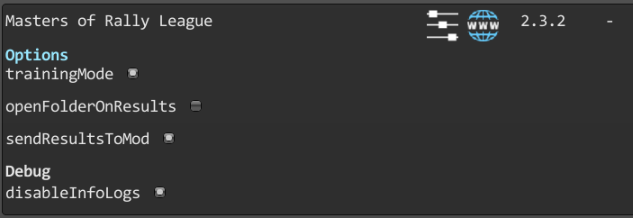



# Masters of Rally League

A mod to support the Masters of Rally League events.

#### Launcher Support

#### Platform Support

## Usage

Select the `MRL season` or `MRL open class` button in the `online events` menu.\
The mod will display the information relative to the current MRL rally and start it after you select your car.

You can also get details and lore on the current event from the Masters of Rally League discord in the `#rally-events` channel.

When you finish the rally, the mod will generate a file containing the results of the rally, called `RallyResults.mrl`

Then it will behave differently depending on your settings :

- **sendResultsToMod is enabled** : the mod will attempt to send results directly to the **MRL discord bot** (this requires you to link your art of rally user name and discord user name through the `/link-mod` MRL discord bot command)
- **openFolderOnResults is enabled** : the mod will open an explorer page to the location of the rally results file

If **sendResultsToMod** is disabled or if the operation failed, you can use the `/submission` command of the MRL discord bot to attach the `RallyResults.mrl` file. The bot will then post the results to the `#submissions` channel.

Press Ctrl + F10 to open the mod manager menu.

### Options

- **trainingMode** : training mode will enable the restarts and disable results generation. You can enable training mode during the rally.
- **openFolderOnResults** : will open the folder in which the results will be written at the end of the rally.
- **sendResultsToMod** : will attempt to send the results directly to the MRL discord bot.

Disabling the mod in the manager will do nothing by default.

## Disclaimer

You'll have to join the [Masters of Rally League discord server](https://discord.gg/U9bdFC7v5m) to partake in events.\
This mod is under heavy development.

## Installation

Follow the [installation guide](https://www.nexusmods.com/site/mods/21/) of
the Unity Mod Manager.\
Then simply download the [latest release](https://github.com/MMike17/ArtOfRally_MRL/releases/latest)
and drop it into the mod manager's mods page.

## Showcase

## Acknowledgments

ISO-3166-1 country codes provided by the package Bia.Countries