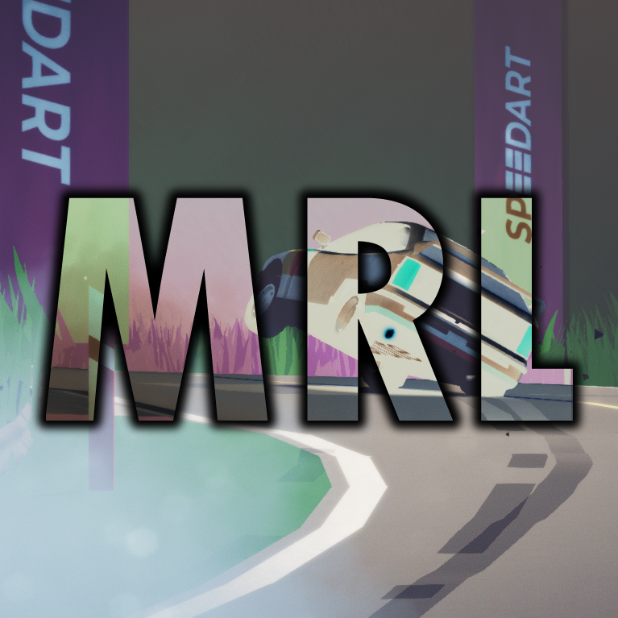
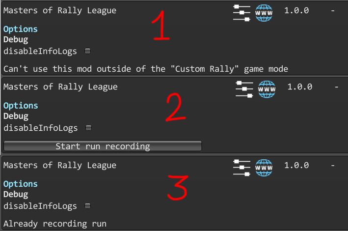
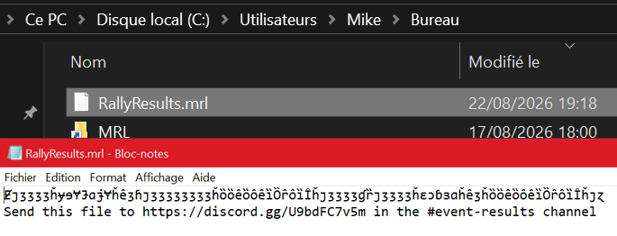



# Masters of Rally League

A mof to support the Masters of Rally League events.

#### Launcher Support

#### Platform Support

## Usage

Check the Masters of Rally League discord for the latest rally event in `#rally-events` channel.\
Setup a custom rally with the right settings.

Press Ctrl + F10 to open the mod manager menu.\
Click the "Start run recording" button in the mod settings pannel and finish the custom rally.

The mod will open an explorer page by the time you finish the rally to the location of the result file.\
You can post this file in `#event-submissions` on the Masters of Rally League discord server.

Disabling the mod in the manager will do nothing by default.

## Disclaimer

You'll have to join the [Masters of Rally League discord server](https://discord.gg/U9bdFC7v5m) to partake in events.\
This mod is under heavy development.

## Installation

Follow the [installation guide](https://www.nexusmods.com/site/mods/21/) of
the Unity Mod Manager.\
Then simply download the [latest release](https://github.com/MMike17/ArtOfRally_MRL/releases/latest)
and drop it into the mod manager's mods page.

## Showcase

